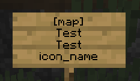

# BlueMapSignMarkers

This plugin replicates Dynmap sign markers.  
Compatible with Paper / Folia.

## Setup

Compile .jar and put it into `plugins`  
Create `markers` directory inside `bluemap/web` directory.  
Put markers png into `bluemap/web/markers`.  
Please use png images. Other images are not supported.  

## How to use
Place a sign.

- 1st line: "[map]"
- 2nd line: text
- 3rd line: text
- 4th line: image name (without .png)

If path to `bluemap/web/markers/icon_name.png` is successful, the sign and BlueMap markers will update.  
The marker is removed when the sign is destroyed.

## Example

This will create a "TestTest" marker on the map with `bluemap/web/markers/icon_name.png` as icon.  
  

## Download

Download on [Modrinth](https://modrinth.com/plugin/bluemapsignmarkers)
